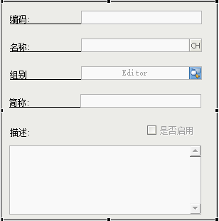
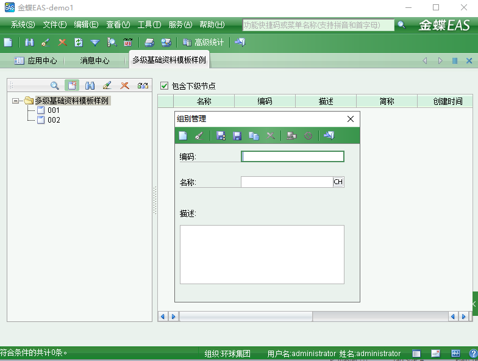
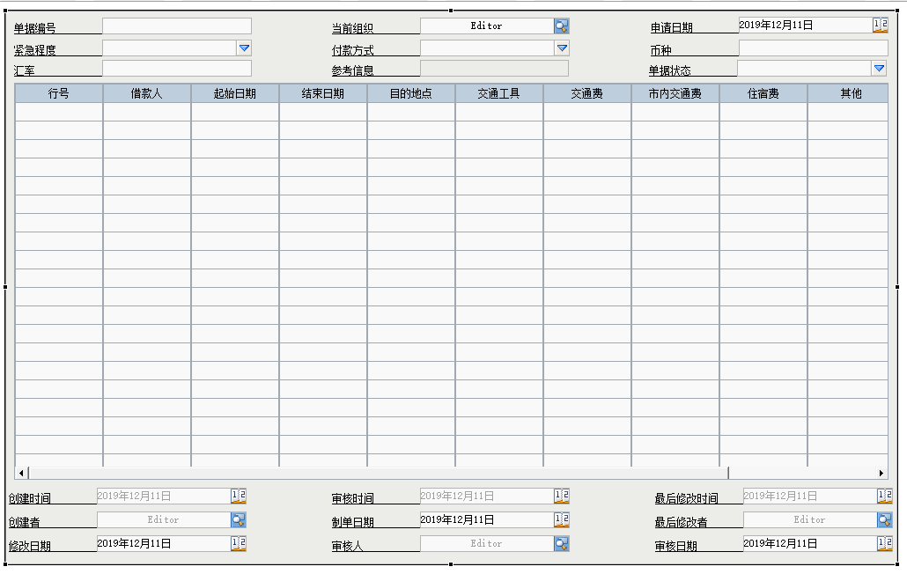
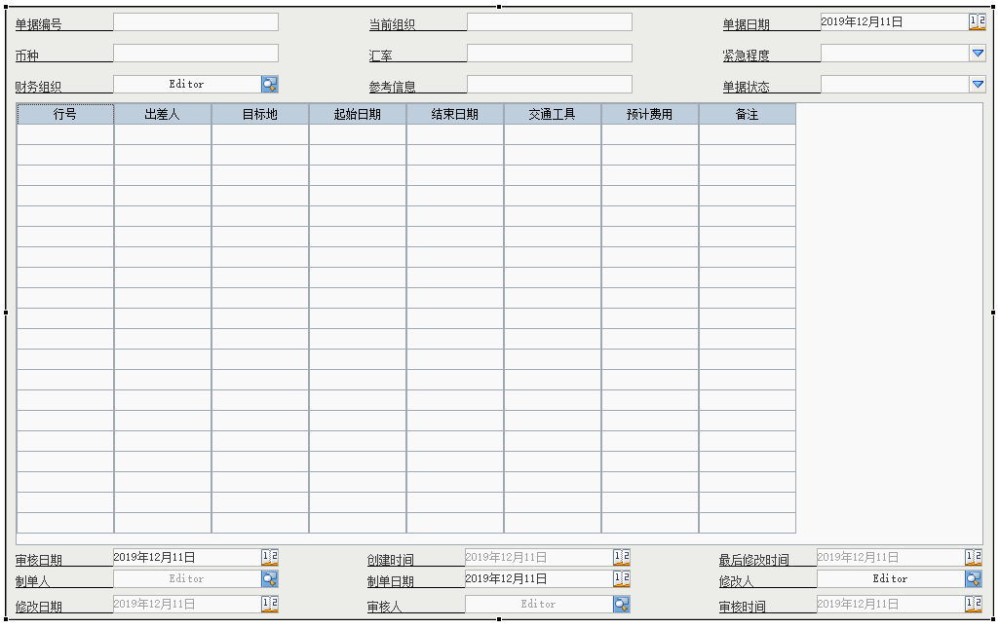
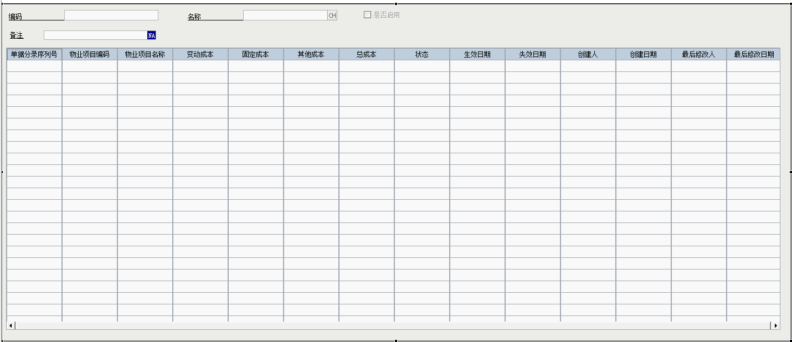
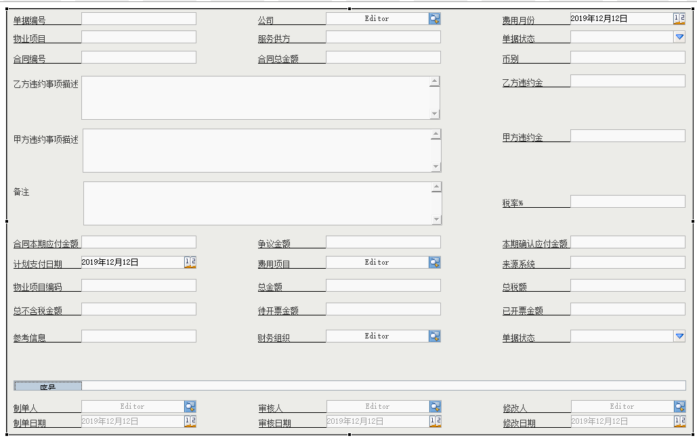

# 金蝶二开demo实战

### 创建左树右表基础资料

+ 效果如下





### 快速开发案例-出差借款单

+ 效果如下



### 快速开发案例-出差借款单

+ 效果如下


### 项目演习

#### 收费项目成本

+ 效果如下



#### 关键服务费用确认单

+ 效果如下



### 新人十万个为什么部分问题收录

1. 如何修改表格中的列名？

> 答:双击表格 --> 选中此列 --> name --> 值(重新输入) --> 确定

2. 系统客户端中系统菜单编辑中编辑与简码的设置规则？

> 答:一般为英文命名可以不带数字

3. 为什么我在系统菜单编辑中新增了对应的业务单元在客户化菜单中确找不到？

> 答:重启客户端后找到了。

4. 我们目前的技术需要我们掌握的主要有GUI/WEB/SHR/报表(Bos/扩展)/DEP/WebServerice/移动BOS，那么我的问题是SHR以及后续的技术是干嘛使以及干嘛用的？(需要从大的方面来理解这些技术)

> 答: bos 需要手动完成界面，数据展示
	拓展:只需完成取数据 sql语句
	soapui.exe webServerice工具
	云之家 wsdl
	DEPT：热布置代码工具
	
5. 是否有必要将BOS开发工具中配置注释模版？

> 答: checkstyle文件夹里第二个xml为注释模板，需要自己导入BOS里面。

6 网上订货单编辑模块:服务器URL地址中参数inwafpage值更改为false的作用? 

> 答:脱壳

7. 定义字段类型为小数时 其长度为28小数位数为10是表明其是固定还是小于这个范围? 

> 答:固定，需要自己定义

8. 如何区分需求是业务单据还是基础资料？

> 答:需求直接明确

9. GUI字段管理隐藏/或删除模版字段?

> 答:查看关联元素 -->双击倒数第二个 --> 删除控件

10. GUI开发的正常操作流程

> 答: 制作完成后 --> 发布业务单元 --> 登录管理员客户端--> 将新建的业务单元弄到客户端 --> 测试

11. sHR开发环境搭建及打包部署没有相关的文档

> 答: 这个暂时放弃

12. WebModelCreateEventHandler.class 文件一直未找到？

> 未区分打开 打开资源(ctrl + shift + R) 与 打开类型的区别
>(ctrl + shift + T 一般用来查找java文件) 此处应该用 打开资源来查找

13. 解决web服务器为啥不出现样式?

> 答:费尽很长很长的时间跟代价终于解决了！！！我的个天。。。但还是不太完美，只有父类有样式，子类没有。。。

14. 双击刚刚增加的业务单元弹出提示框是哪里出了问题？如何解决？ 15:58

> 弹出框信息：很抱歉，系统检测到您的网络连接或服务器响应异常，系统不能正常执行操作任务，
> 请选择重新登录或退出系统。
> 下面按钮有:用户反馈 尝试重连 退出系统 忽略
> 答: 右键业务单元 --> 更新数据库 即可解决

15. 有的输入框在客户端特别长是什么原因?

> 答: 可能锚定没有设置好。

16. 如何将虚拟磁盘还原成普通磁盘？

> 答: 先脱机然后删除对应文件即可。

17. 表格列不够时如何让其等比缩放，充满所见窗口容器？

> 答: 目前不可实现，只能在代码里面调数值。

18. 更新解决方案来源时报: 非法的解决方案安装目录(不存在server/lib目录) 的bug如何解决?

> 答: 参考 服务安装目录: E:\soft\Kingdee\easServer\eas\server

19. Bos导入钢铁单据模板无法选择且无法点击下一步？ 16：12

> 答: 多半是ST钢铁模板v2.0的st文件夹路径复制错误，正确的路径应该是复制到 例: W:\Project_0\metadata\com\kingdee\eas

20. 类型 TestBillListUI 的层次结构不一致？17:10

> 答: 这种错误一般有很多的java类都报红报错，一般就是发布业务单元失败所致，所以正确解决方法为
> 将刚刚发布业务单元所生成的java代码全部删除,然后重新发布业务单元，并且一般这个时候就
> 可以将钢铁的st文件夹放在与custom同级，即可解决。

21. 如何更新BOS开发工具的背景颜色？

> 答:安装插件com.github.eclipsecolortheme_1.0.0.201410260308.jar
> 示例位置: E:\soft\Kingdee\BOS\bos\BOSModular\platform\eclipse\plugins
> 窗口 --> 首选项 --> 常规 --> 外观 --> Color Theme --> Sublime Text2

22. 如何导入注释模板？

> 答: 窗口 --> 首选项 --> Java --> 代码样式 --> 代码模板 --> 注释 --> 导入 alt + shift + j

23. 客户端一直卡住正在初始化系统？

> 答:https://note.youdao.com/ynoteshare1/index.html?id=66a9cd803c874a5545e0ef8dd7511718&type=note

23. 在枚举时查到的枚举如何确定枚举值是否与需求一致?

> 答: 搜索 --> 搜索无数据(输入枚举的英文名，可以找到对应的枚举值)

24. 如何解决编码规则无效的问题?

```Java
// *编码规则生成的编码
    ICodingRuleManager iCodingRuleManager = CodingRuleManagerFactory.getLocalInstance(ctx);
    Element companyTemp1 = billHeadNode.element("companyNumber");
    if (companyTemp1 != null && !"".equals(companyTemp1.getTextTrim())) {
      try {
        number = iCodingRuleManager.getNumber(info, companyTemp1.getTextTrim());
      } catch (Exception e) {
        msg = "收款单接口————收款单指定的编码规则未启用，无法新增，请联系EAS管理员进行启用！";
        logger.info("\n"+msg+"\n报文：\n"+paramsXML+"\n错误信息：\n"+e.getMessage());
        msg = ToJsonMsgUtil.loadJson("", "", msg, "1");
        return msg;
      }
    }
```

25. 客户端如何执行sql语句?

> 答: 客户端搜索 “币别” 确定之后 ctrl + shift + q 输入密码后则可以执行sql语句

26. 模板自带字段不能删除，要其不显示在页面上如何操作？

> 设计视图 --> metadata 文件夹内 找到 其EditUI.ui
> 示例 metadata/com/kingdee/eas/custom/bill/client/TLSlipEditUI.ui
> 点击打开 --> 状态相关 --> visible --> false
> 设置完成后其在客户端则不可见就已达到目的

27. 如何在基础资料里生成分录(表格)?

> 答: 右键--> 单据信息 --> 新增 --> 输入分录名/分录描述 --> 确定 --> 确定

28. 单据体如何设置其列的单元格是否可录入，是否必录项?

> 答: 进入设计视图 --> 双击-->表列 --> 选中某列--> 右侧调整属性对应的值
